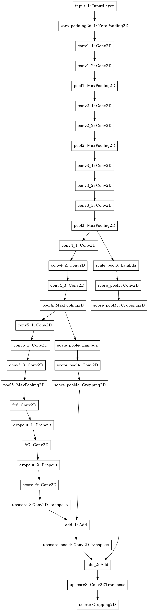

# keras-fcn

[](https://travis-ci.org/JihongJu/keras-fcn) [](https://codecov.io/gh/jihongju/keras-fcn)[](https://opensource.org/licenses/MIT)

A re-implementation of Fully Convolutional Networks with Keras

### Installation

#### Dependencies


1. [keras](https://keras.io/#installation)
2. [tensorflow](https://www.tensorflow.org/install/)/[theano](http://deeplearning.net/software/theano/install.html)/[CNTK](https://docs.microsoft.com/en-us/cognitive-toolkit/Setup-CNTK-on-your-machine)


#### Install with `pip`

```bash
$ pip install git+https://github.com/JihongJu/keras-fcn.git
```


#### Build from source

```bash
$ git clone https://github.com/JihongJu/keras-fcn.git
$ cd keras-fcn
$ pip install --editable .
```

### Usage

Import the FCN8s model and compile

```python
from keras_fcn import FCN
fcn_vgg16 = FCN(basenet='vgg16', trainable_base=False, weights='imagenet'
                input_shape=(500, 500, 3), num_output=21)
fcn_vgg16.compile(optimizer='rmsprop',
                  loss='categorical_crossentropy',
                  metrics=['accuracy'])
fcn_vgg16.fit(X_train, y_train, batch_size=1)
```

More details see [Training Pascal VOC2011 Segmention](https://github.com/JihongJu/keras-fcn/blob/master/voc2011/train.py)

#### Try Examples

1. Download [VOC2011](http://host.robots.ox.ac.uk/pascal/VOC/voc2011/) dataset

```bash
$ wget "http://host.robots.ox.ac.uk/pascal/VOC/voc2011/VOCtrainval_25-May-2011.tar"
$ tar -xvzf VOCtrainval_25-May-2011.tar
$ mkdir ~/Datasets
$ mv TrainVal/VOCdevkit/VOC2011 ~/Datasets
```

2. Mount dataset from host to container and start bash in container image

From repository `keras-fcn`

```bash
$ nvidia-docker run -it --rm -v `pwd`:/root/workspace -v ${Home}/Datasets/:/root/workspace/data jihong/keras-gpu bash
```

or equivalently,
```bash
$ make bash
```

3. Within the container, run the following codes.

```bash
$ cd ~/workspace
$ source venv/bin/activate
$ pip install -r requirements
$ pip setup.py build
$ cd voc2011
$ python train.py
```

More details see source code of the example in `jihong/keras-fcn/voc2011`.


### Model Architecture

FCN8s with VGG16 as base net:




### TODO

 - Add ResNet
